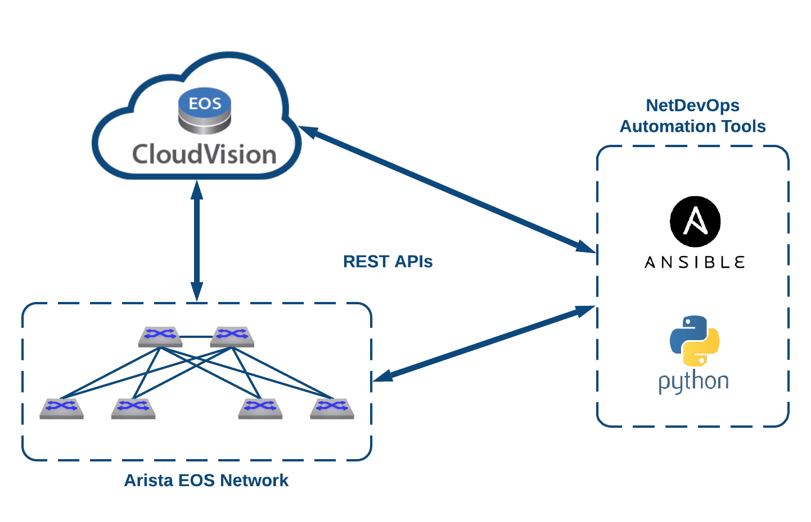

# Automation Demonstration Overview
Purpose of of this repo is to provide automation examples of Ansible and Python to interact with REST API's available in CVP and EOS.  The standard Data Center ADC Leaf/Spine Lab is utilized.  There is a Ansible module **read_csv.py** that needs to be copied into the proper location for anisble modules.  This is outlined in step 4 in the Demonstration - Preparation section below.  


# Demonstration - Preparation
1. Create & Start an ADC Data Center - Latest Instance (OneLogin)
2. Connect to ADC Instance (check email for link to lab).  SSH to public address as user:  arista and connect to Shell (bash) option 98 from the menu.
3. Ensure most recent Github repo is cloned ([https://github.com/mthiel117/adc-demo-examples](https://github.com/mthiel117/adc-demo-examples)), remove existing configlets and copy read\_csv.py ansible module into place.

```sh
cd adc-demo-examples
git clone https://github.com/mthiel117/adc-demo-examples
rm configlets/*
sudo cp extras/read_csv.py /usr/local/lib/python2.7/dist-packages/ansible/modules/files/.
```

3.  In CVP Detach &amp; Remove all ADCDEMO configlets.
 
# Demos

### 1. Demonstrate Ansible playbook to create version controlled switch configurations from CSV file
Change directory to demo1
```
cd adc-demo-examples/demo1
```
Show Playbook, CSV Datafile and Jinja2 Template
```
cat create-configlets.yml
cat datafiles/switch_info.csv
cat templates/base-cfg.j2
```
Run playbook and show verify configlets
```
ansible-playbook create-configlets.yml
ls -l configlets/*
cat configlets/adcdemo_spine1.txt
```

### 2. Demonstrate Ansible playbook to create version controlled VLANs form YAML file
  - Change directory to demo1
```
cd adc-demo-examples/demo1
```
  - Show Playbook, YAML file and Jinja2 Template
```
cat vlans.yml
cat group_vars/all
cat templates/vlans.j2
```
  - Run playbook and show verify vlans configlet was created
```
ansible-playbook vlans.yml
cat configlets/adcdemo_vlans.txt
```


### 3.  Use Python to push configlets to CVP
Show CVP Provision --\> Configlets screen to demonstrate configlets do not yet exist in CVP
Run python script to push configlets to CVP
```
./pushconfigs_to_cvp.py
```
  - Verify configlets exists in CVP

1. In CVP Assign ADCDEMO\_VLANS to the Leaf Container
  -- Create Change Control to push new VLANs to all 4 Leafs
  -- Execute Change Control
  -- Verify a Leaf's running-config

2. Modify VLAN YAML file to add a new VLAN, push update to CVP and execute tasks to push update to Leafs.
  - Update VLAN YAML
```
vi group_vars/all
```
  - Update vlan configlet with a 2nd Playbook run
``` 
ansible-playbook vlans.yml
```
  - Push updated configlet to CVP

```
./pushconfigs_to_cvp.py
```
  - In CVP Change Control Tasks to push out VLAN updates to Leafs
  - Verify changes on Leafs

### 4. INSERT [eAPI Example]
